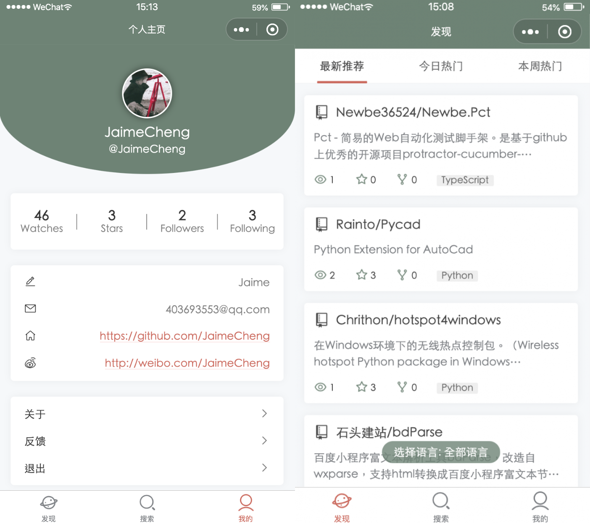
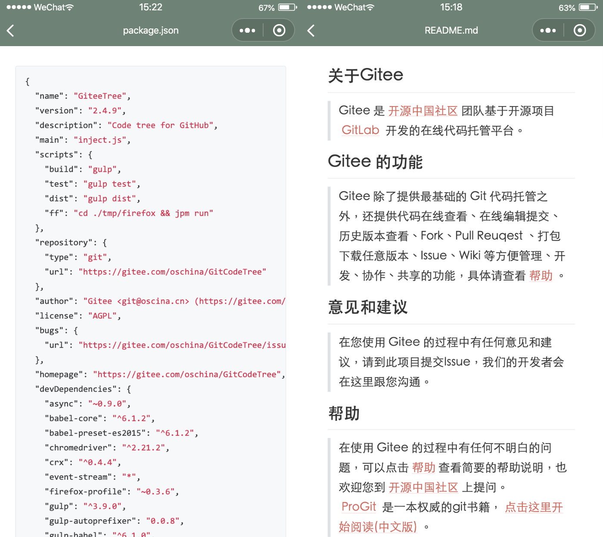

### Gitee+

#### 说明
本仓库为码云 (gitee.com) 用户提供简单的仓库浏览、搜索等功能的微信小程序。  
该项目采用微信小程序原生语法  + [ vant-ui](https://github.com/youzan/vant-weapp) 进行开发，数据均来自 [码云 Open Api](https://gitee.com/api/v5/swagger#/getV5ReposOwnerRepoStargazers?ex=no)。  
markdown解析采用的是 [towxml](https://github.com/sbfkcel/towxml)，感谢以上作者。  

#### 技术总结
[Gitee+ —— 码云微信小程序的从零到一](https://www.jianshu.com/p/cc3c9df6db96)

**水平有限，请各位大佬前来指点！！！**  

**此源码仅供交流学习，严禁以任何形式独立发布或用于商业用途。**

#### 待解决
- [x] ~~svg等文件的解析~~；

#### 示例

#### 体验

